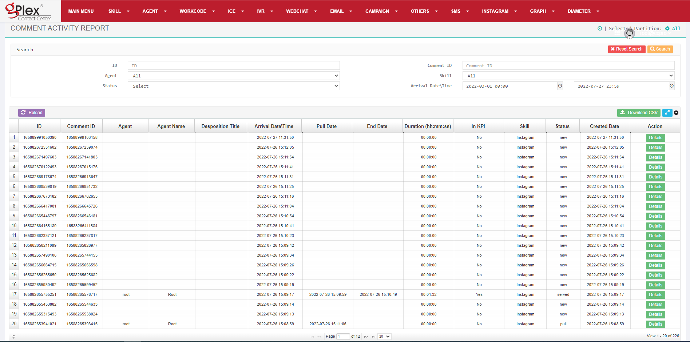

<h1 align="center">
  Robi Airtel Socialminer 
  
</h1>
<h5>For the confidentiality issues source code of the project couldn't deliver. Only few UI are attached for my work demonstration.</h5>
 

Dashboard of Root user

  

 

Instagram manager module

  

 

Report of services of agent with details

  

 

Report with menu

  

